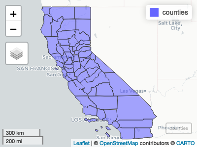
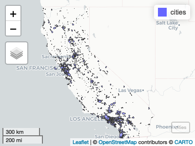
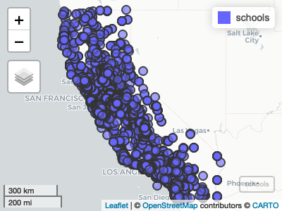
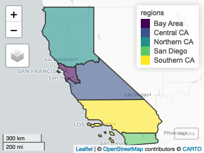

<!-- README.md is generated from README.Rmd. Please edit that file -->

# camapping

<!-- badges: start -->

<!-- badges: end -->

camapping is a collection of commonly used vector data in California.

## Installation

You can install the released version of camapping from GitHub with:

``` r
remotes::install_github("ir-sfsu/camapping")
```

## Counties

``` r
library(camapping)
library(mapview)
mapview(counties)
```



## Cities

``` r
mapview(cities)
```



## Schools

``` r
mapview(schools)
```



## Regions

``` r
mapview(regions)
```


